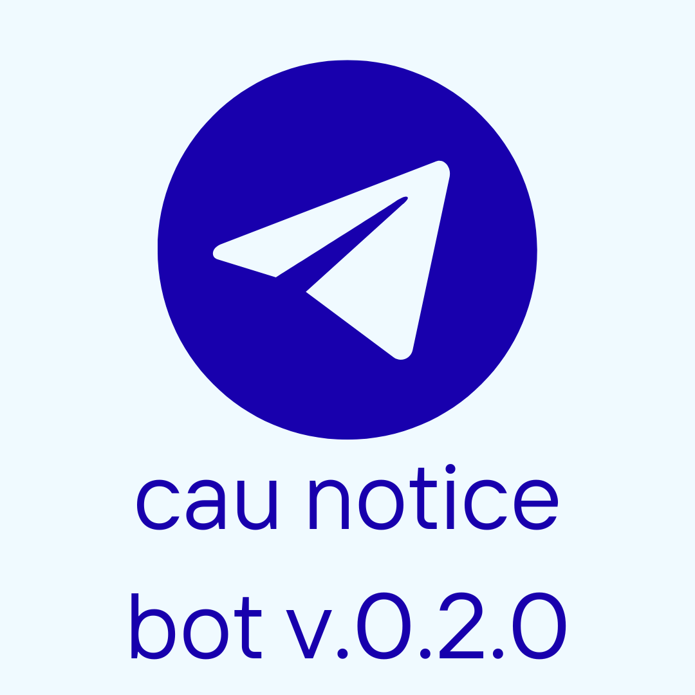

# CAU Notice Bot v0.2.0

<p align="center">
  
</p>

Chung-Ang University notice alert Discord bot

---

## What it does

Sends new notices from the past 24 hours to a Discord channel every day at 8 AM KST

**Sources**
- 📢 **CAU Official Notices**
- 📚 **Library Notices**
- 🌈 **Rainbow System Links**

## How it works

```
GitHub Actions (Daily 08:00 KST)
    ↓
Fetch CAU API → Check new notices
    ↓
Send alerts via Discord Webhook
```

## Development

```bash
# Install dependencies
uv sync --extra dev

# Run tests
uv run pytest

# Lint check
uv run ruff check .

# Auto-fix lint issues
uv run ruff check --fix .

# Format code
uv run ruff format .

# Run bot
uv run python -m src.main
```

