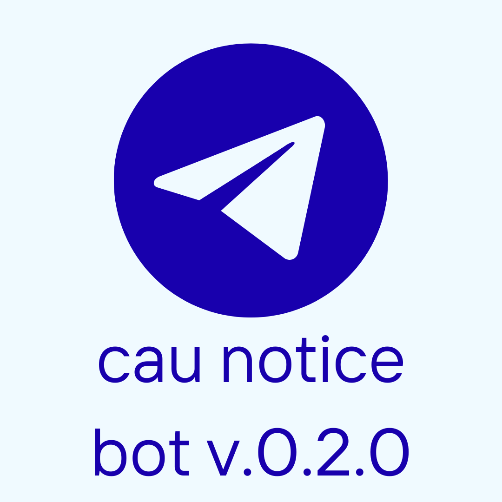

# CAU Notice Bot v0.2.0

<p align="center">
  
</p>

Chung-Ang University notice alert Discord bot

---

## What it does

Sends new notices from the past 24 hours to one or more Discord channels every day at 8 AM KST

**Sources**
- 📢 **CAU Official Notices**
- 💻 **Software Department Notices**
- 📚 **Library Notices**
- 🔬 **DISU Semiconductor Notices**
- 🏢 **NIPA Business Notices**
- 🌈 **Rainbow System Links**

## How it works

```
GitHub Actions (Daily 08:00 KST)
    ↓
Fetch CAU API → Check new notices
    ↓
Send alerts via Discord Webhook
```

## Environment

```env
DISCORD_BOT_TOKEN=your_bot_token
DISCORD_CHANNEL_IDS=123456789012345678,987654321098765432
CAU_SW_NOTICE_URL=https://cse.cau.ac.kr/sub05/sub0501.php?offset=1&nmode=list&code=oktomato_bbs05
CAU_SW_NOTICE_STATE_FILE=.state/sw_last_seen_uid.txt
DISU_NOTICE_URL=https://www.disu.ac.kr/community/notice
DISU_NOTICE_STATE_FILE=.state/disu_last_seen_bbsidx.txt
NIPA_NOTICE_URL=https://nipa.kr/home/2-2
NIPA_NOTICE_STATE_FILE=.state/nipa_last_seen_ntt_no.txt
```

- `DISCORD_CHANNEL_IDS` is required and supports one or more IDs (comma-separated).
- `CAU_SW_NOTICE_STATE_FILE` stores a single `last_seen_uid` value for software notice dedupe.
- `DISU_NOTICE_STATE_FILE` stores a single `last_seen_bbsidx` value for DISU notice dedupe.
- `NIPA_NOTICE_STATE_FILE` stores a single `last_seen_ntt_no` value for NIPA notice dedupe.

## Development

```bash
# Install dependencies
uv sync --extra dev

# Run tests
uv run pytest

# Lint check
uv run ruff check .

# Auto-fix lint issues
uv run ruff check --fix .

# Format code
uv run ruff format .

# Run bot
uv run python -m src.main
```

